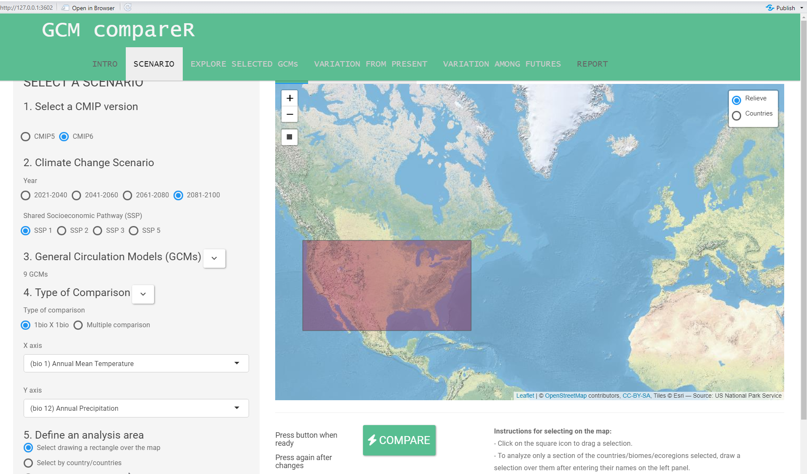

```{r setup, include=FALSE}
knitr::opts_chunk$set(echo = FALSE, warning = FALSE)
```

## Summary of the Global Circulation Model Selection

#### `r Sys.Date()`

## Goal

Determine the four most centrally located global circulation model (GCM) across four [Shared Socio-economic Pathways](https://www.carbonbrief.org/cmip6-the-next-generation-of-climate-models-explained) (SSPs)(126, 245, 370 and 585) at the 2081-2100 time stamp. The four most common centrally located GCM will be used in as the inputs for the larger project.

### Parameters

Models were evaluated using a local deployment of the GCM compareR shiny application.

https://github.com/marquetlab/GCM_compareR

https://besjournals.onlinelibrary.wiley.com/doi/full/10.1111/2041-210X.13360



1.  CMIP version: CMIP6

2.  Climate Change Scenario:

    1.  year: 2081-2100 - this year was choose as it will represent the largest amount of divergence between the models.

    2.  Shared Socioeconomic Pathways (SSP): This is a measure of emission intensity, all four options were evaluated.

3.  General Circulation Models: all available models were considered

4.  Type of Comparison

    1.  Bio1 - Annual Mean Temperature

    2.  Bio2 - Annual Precipitation

5.  Define analysis area

    1.  created a generous retangle of CONUS

    2.  xmin : -125.5812, xmax : -69.46746, ymin : 23.85369, ymax : 47.87214

```{r, message=FALSE}
    pacman::p_load("dplyr","tidyr", "readr","DT","plotly")
    source("src/summaryDocFunctions.R")

    # tables 
    s1 <- read_csv("output/gcmModeling/ssp1/table.csv")%>%
      filterGMC()%>%
      rankGMC()
    s2 <- read_csv("output/gcmModeling/ssp2/table.csv")%>%
      filterGMC()%>%
      rankGMC()
    s3 <- read_csv("output/gcmModeling/ssp3/table.csv")%>%
      filterGMC()%>%
      rankGMC()
    s5 <- read_csv("output/gcmModeling/ssp5/table.csv")%>%
      filterGMC()%>%
      rankGMC()

    # determine the number of features 
    gmcs <- unique(c(s1$GCM, s2$GCM, s3$GCM, s5$GCM))
    ssps <- c("ssp1", "ssp2", "ssp3","ssp5")
    ssp2 <- list(s1,s2,s3,s5)

    #summary of gcm 
    df <- data.frame(matrix(nrow = 8, ncol = 5))
    names(df) <- c("GCM", "ssp1", "ssp2", "ssp3","ssp5")
    df$GCM <- sort(gmcs)
    for(i in seq_along(df$GCM)){
      model <- df$GCM[i]
      for(j in seq_along(ssp2)){
        proj <- ssps[j]
        dat <- ssp2[[j]]
        if(model %in% dat$GCM){
          dat2 <- dat[dat$GCM == model,]
          df[i,j+1] <- dat2$difference
        }
      }
    }
    df <- df %>%
      dplyr::rowwise()%>%
      dplyr::mutate(average = mean(c(ssp1,ssp2,ssp3,ssp5), na.rm=TRUE))%>%
      dplyr::arrange(average)
    
t <- list(
  family = "sans serif",
  size = 14,
  color = toRGB("grey50"))    

```

## Difference method

The following steps were used to generate a single measure for evaluation.

1.  Difference from mean.

-   absolute value of x - Mean of range of values
-   applied to temperate and precipitation

2.  Normal the difference from mean

-   Value = {(x-min(x))/(max(x)-min(x))} ; where x is a vector of all temperature or precipitation values

3.  Combine the noralized values

-   value = normalize temperature + normalized precipitation

The result is a single value that weight temperature and precipitation evenly.

## Summary

By combining the individual evaluations at each Shared Socioeconomic Pathway we are able to evaluate which GCMs are nearest to the average across all ssp pathways.

```{r}
datatable(df)
```

The top for models

**CNRM.ESM2.1** **MIROC6** **MIROC.ES2L** **CNRM.CM6.1**

Are the current suggestion for use as the ensemble dataset for creating a generalized prediction of the future maximim temperature, minimum temperature, and precipitation at varies NPGS sites.

# Individual Shared Socioeconomic Pathways

## SSP1

The following GCM are present at the SSP1 category.

```{r}
datatable(s1)
```

This is a plot of the normalized difference from the mean for all GCMs. Ensemble represents the mean of all temperature and precipitation values.

```{r}
s1<-s1 %>%
  add_row(GCM = "ensemble",
          temp = mean(s1$temp,na.rm = TRUE),
          prec =  mean(s1$prec,na.rm = TRUE),
          difference = NA)

plot_ly(data = s1, x = ~temp, y = ~prec,  color = ~GCM ,  colors = "Set1", text = ~GCM)%>% 
  add_markers()%>%
  add_text(textfont = t, textposition = "top right", showlegend = F)

```

## SSP2

The following GCM are present at the SSP1 category.

```{r}
datatable(s2)
```

This is a plot of the normalized difference from the mean for all GCMs. Ensemble represents the mean of all temperature and precipitation values.

```{r}
s2<-s2 %>%
  add_row(GCM = "ensemble",
          temp = mean(s2$temp,na.rm = TRUE),
          prec =  mean(s2$prec,na.rm = TRUE),
          difference = NA)

plot_ly(data = s2, x = ~temp, y = ~prec,  color = ~GCM ,  colors = "Set1", text = ~GCM)%>% 
  add_markers()%>%
  add_text(textfont = t, textposition = "top right", showlegend = F)
```

## SSP3

The following GCM are present at the SSP1 category.

```{r}
datatable(s3)
```

This is a plot of the normalized difference from the mean for all GCMs. Ensemble represents the mean of all temperature and precipitation values.

```{r}
s3<-s3 %>%
  add_row(GCM = "ensemble",
          temp = mean(s3$temp,na.rm = TRUE),
          prec =  mean(s3$prec,na.rm = TRUE),
          difference = NA)

plot_ly(data = s3, x = ~temp, y = ~prec,  color = ~GCM ,  colors = "Set1", text = ~GCM)%>% 
  add_markers()%>%
  add_text(textfont = t, textposition = "top right", showlegend = F)
```

## SSP5

The following GCM are present at the SSP1 category.

```{r}
datatable(s5)
```

This is a plot of the normalized difference from the mean for all GCMs. Ensemble represents the mean of all temperature and precipitation values.

```{r}
s5<-s5 %>%
  add_row(GCM = "ensemble",
          temp = mean(s5$temp,na.rm = TRUE),
          prec =  mean(s5$prec,na.rm = TRUE),
          difference = NA)

plot_ly(data = s5, x = ~temp, y = ~prec,  color = ~GCM ,  colors = "Set1", text = ~GCM)%>% 
  add_markers()%>%
  add_text(textfont = t, textposition = "top right", showlegend = F)
```
